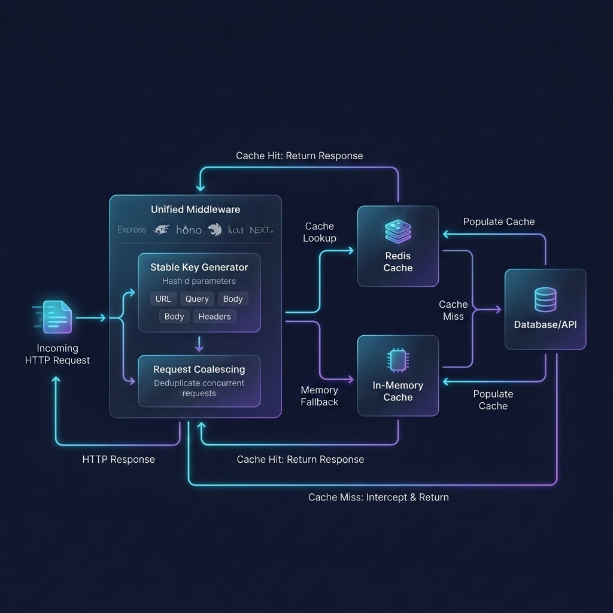

# query-cache-engine 🚀

`query-cache-engine` is a lightweight, framework-agnostic, transparent caching library for Node.js. It intercepts and caches database query results, API responses, or generic function return values in Redis, with an automatic in-memory failover.

The package exposes a unified **`.middleware()`** helper that dynamically detects the framework environment (Express, Fastify, Hono, NestJS, Koa, Next.js) and configures the caching hooks automatically.

<p align="center">
  
</p>

---

## Core Features
- **Unified Middleware**: One method (`cacheManager.middleware()`) to cache routes across Express, Fastify, Hono, NestJS, and Koa.
- **Request Coalescing (Single Flight)**: Concurrent requests for the same cache miss wait for the first callback execution rather than duplicating queries to your database.
- **Stable Key Generator**: Deterministically sorts query parameters, objects, and headers so that matching payloads produce the exact same cache hash.
- **Automatic In-Memory Fallback**: Switches automatically to local Memory storage if your Redis server goes offline, recovering seamlessly once it reconnects.
- **Tag-based Invalidation**: Invalidate groups of cache entries by tags.

---

## Installation

```bash
npm install query-cache-engine ioredis
```

---

## Recommended Setup (Centralized Initialization)

For production environments, it is recommended to initialize a single shared `CacheManager` instance in a dedicated configuration file (e.g., `cache.ts` or `queryEngine.ts`) and import it wherever caching or middleware is needed.

This allows you to configure connection retry limits, custom loggers, and manage the automatic in-memory failover cleanly:

```typescript
// cache.ts
import { CacheManager } from 'query-cache-engine';

export const cache = new CacheManager({
  redis: {
    host: '127.0.0.1',
    port: 6379,
    maxRetriesPerRequest: 1, // Fail fast to activate in-memory fallback quickly if Redis drops
    retryStrategy(times) {
      // Reconnect strategy: retry up to 3 times, waiting 5 seconds between attempts
      if (times > 3) {
        return null; // Stop reconnecting and remain on Memory fallback
      }
      return 5000;
    },
  },
  defaultTtl: 300, // Default cache lifetime in seconds (5 minutes)
  useMemoryFallback: true, // Enable automatic in-memory backup if Redis goes offline
  logger: {
    info: (msg) => console.log(`[Cache INFO] ${msg}`),
    error: (msg) => console.error(`[Cache ERROR] ${msg}`),
  },
});
```

---

## Quick Start (Async Function & DB Cache)

Wrap heavy database queries or expensive function calls using the `remember()` API with your initialized `cache` instance:

```typescript
import { cache } from './cache';

// Cache database queries transparently
const users = await cache.remember('all-users', 60, async () => {
  return await db.select().from(usersTable);
});
```

---

## Unified Middleware Integrations

Expose automatic caching at the global or route-specific levels across every web technology.

### Middleware Options (`CacheMiddlewareOptions`)
The `.middleware()` helper accepts the following configuration object:

| Option | Type | Default | Description |
| :--- | :--- | :--- | :--- |
| **`ttl`** | `number` | `defaultTtl` | Cache expiration time (in seconds). |
| **`tags`** | `string[] \| ((req) => string[])` | `[]` | Expiry tags array or function returning tags from request context. |
| **`methods`** | `string[]` | `['GET']` | HTTP methods allowed for caching (e.g., `['GET', 'POST']` for heavy search listings). |
| **`keyOptions`** | `KeyGeneratorOptions` | `{}` | Key generation options (e.g., matching custom HTTP headers). |
| **`cacheErrorResponses`** | `boolean` | `false` | Set `true` to store non-2xx status codes or client/server errors. |

### 1. Express
Cache Express routes transparently by intercepting responses:

```typescript
import express from 'express';
import { CacheManager } from 'query-cache-engine';

const app = express();
const cache = new CacheManager({ redis: { host: '127.0.0.1' } });

// Route-level caching
app.get(
  '/api/users',
  cache.middleware({
    ttl: 30, // cache for 30s
    tags: ['users'],
    keyOptions: { headers: ['tenant-id'] } // Dynamically include custom headers in key
  }),
  async (req, res) => {
    res.json(await fetchUsers());
  }
);
```

### 2. Fastify
Fastify plugins and route lifecycle hooks are configured automatically at runtime:

```typescript
import Fastify from 'fastify';
import { CacheManager } from 'query-cache-engine';

const fastify = Fastify();
const cache = new CacheManager({ redis: { host: '127.0.0.1' } });

// Register cache plugin globally
fastify.register(cache.middleware({
  ttl: 30,
  tags: ['users'],
}));

fastify.get('/api/users', async (request, reply) => {
  return reply.send(await fetchUsers());
});
```

### 3. NestJS (Interceptors)
Dynamic NestJS HTTP context Interceptor handles route caching:

```typescript
import { Controller, UseInterceptors, Get } from '@nestjs/common';
import { CacheManager } from 'query-cache-engine';

const cache = new CacheManager({ redis: { host: '127.0.0.1' } });

@Controller('users')
@UseInterceptors(cache.middleware({ ttl: 60, tags: ['users'] }))
export class UserController {
  @Get()
  getUsers() {
    return this.userService.findAll();
  }
}
```

### 4. Hono (Bun / Deno / Node.js)
Hono middleware is lightweight and works natively in Bun, Deno, and standard runtimes:

```typescript
import { Hono } from 'hono';
import { CacheManager } from 'query-cache-engine';

const app = new Hono();
const cache = new CacheManager({ redis: { host: '127.0.0.1' } });

// Attach to Hono routes
app.get(
  '/api/users',
  cache.middleware({ ttl: 60, tags: ['users'] }),
  async (c) => c.json(await fetchUsers())
);
```

### 5. Koa
```typescript
import Koa from 'koa';
import { CacheManager } from 'query-cache-engine';

const app = new Koa();
const cache = new CacheManager({ redis: { host: '127.0.0.1' } });

// Koa context interception
app.use(cache.middleware({ ttl: 30 }));
```

### 6. Next.js (App Router Route Handlers)
Wrap Next.js Route Handlers cleanly:

```typescript
import { CacheManager } from 'query-cache-engine';

const cache = new CacheManager({ redis: { host: '127.0.0.1' } });

export const GET = cache.middleware({ ttl: 60 }, async (req) => {
  const data = await fetchUsers();
  return Response.json(data);
});
```

---

## Invalidation Strategies

### 1. Invalidate by Tag
Invalidating a tag clears all cache entries associated with it:

```typescript
// Clears all keys stored under tag 'users'
await cacheManager.invalidateTag('users');
```

### 2. Invalidate by Key or Route
```typescript
// Invalidate a specific key
await cacheManager.invalidate('cache:GET:users:8a7df9...');

// Invalidate all keys related to a specific route
await cacheManager.invalidateRoute('/api/users');
```

### 3. Invalidate by Pattern (Glob matching)
```typescript
// Clear all user cache keys
await cacheManager.invalidatePattern('cache:GET:users:*');
```

### 4. Clear Everything
```typescript
// Wipe out all cache entries
await cacheManager.clear();
```

---

## Request Coalescing (Single Flight)

Under high load, concurrent cache misses can trigger "cache stampedes" that overload database engines. `query-cache-engine` guarantees only one callback executes:

```
[Request 1] ──┐
[Request 2] ──┼──> [Cache MISS] ──> [Executes DB Query Once] ──> [Cache SET] ──> [All return same result]
[Request 3] ──┘
```

---

## License

ISC
